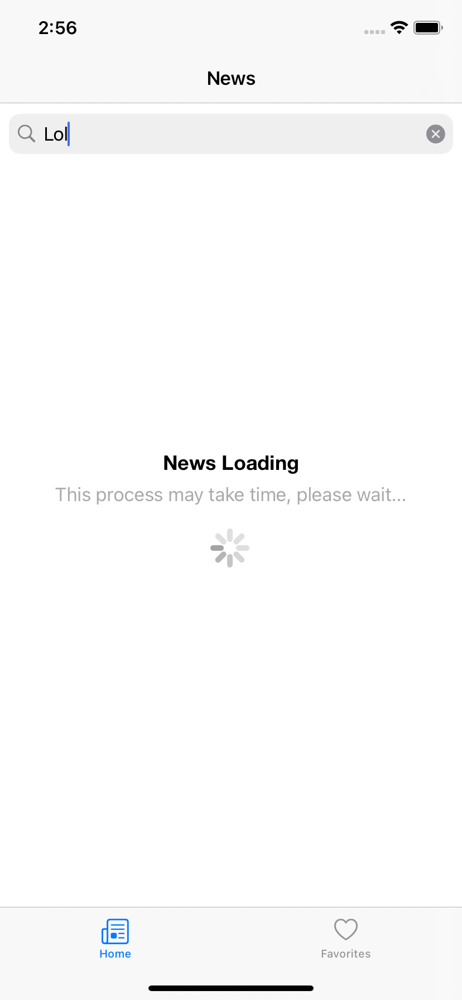
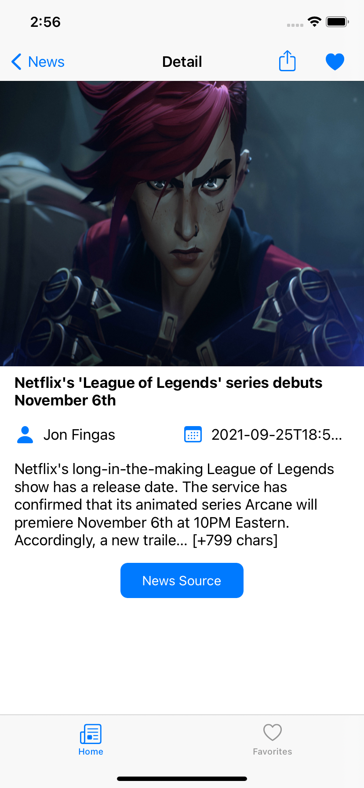
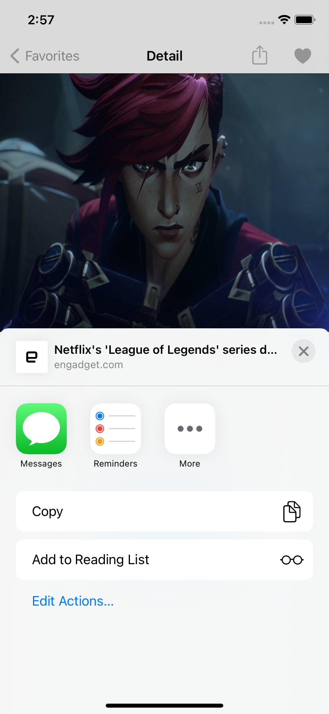
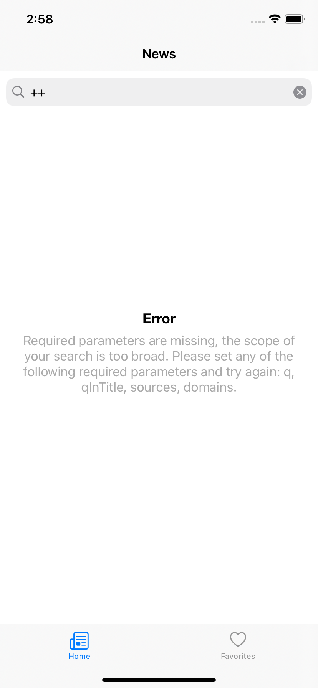
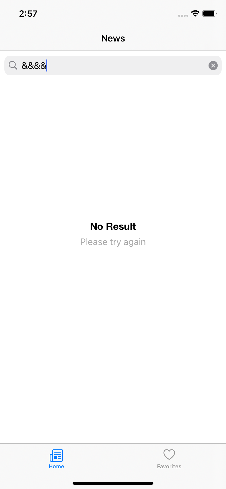
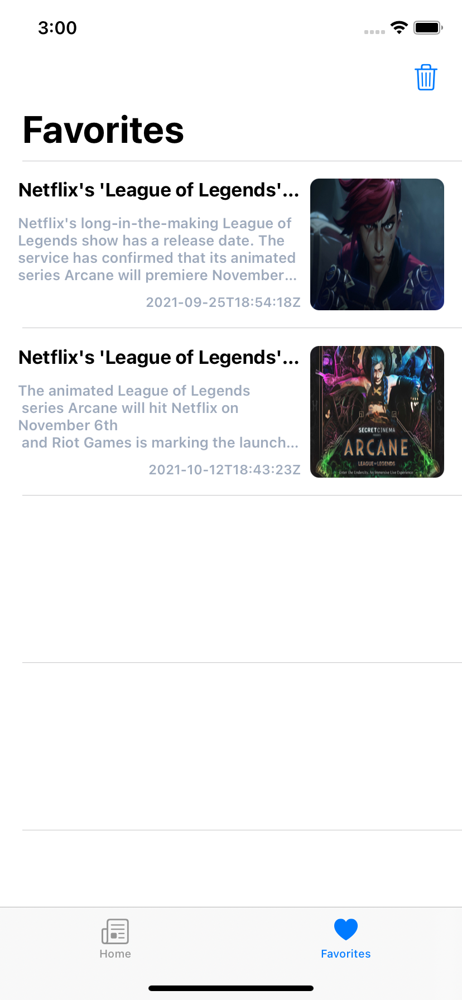
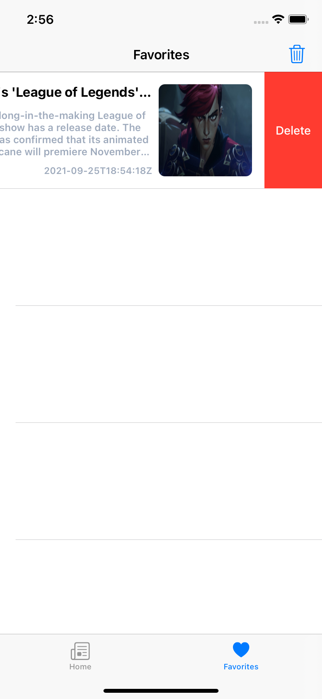

# Appcent-Case

It's News app that using the NewsAPI.


# Features
* List News
* Show News Detail
* Add Favorite
* Delete Favorite
* Clear Favorites
* Share News
* Show news on WebView
* Error Handle
* Response Handle
* Pagination

# Pods

```yaml
  pod 'Kingfisher', '~> 7.0'
  pod 'RealmSwift' 
```

# Screens
   
   
  

